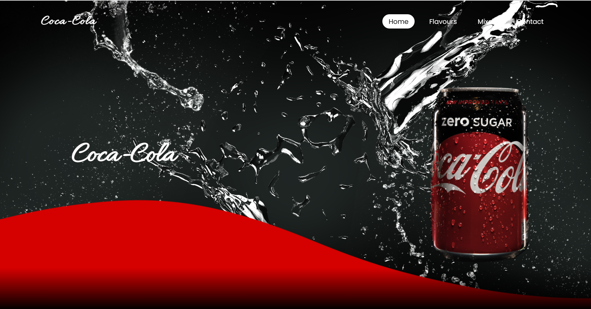
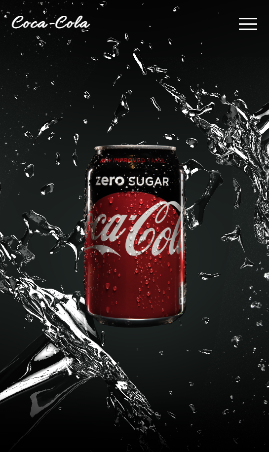

# Coca-Cola Website

This is a recreation of Coca-cola's website using my own design.

Here's the link: https://cocacoladupe.netlify.app/

## screenshots

This is when the website is >900px wide

This is when the website is <900px wide

## References

Images are from FreePik and Unsplash.

Images that I cannot find online, I drew on Procreate and export it to png.

## What I could've done better

<ul>
<li>Navbar more visible
<li>More information about the product
<li>Neater files by putting it in folders
<li>Better designs
<li>More consistent and neater placing of items
<li>More consistent spacings
<li>Better commit message
<li>More consistent push to git repository
</ul>
